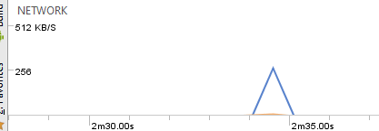

Este app acessa a internet para baixar uma imagem e exibi-la assim que o download for concluído. Mesmo sendo um arquivo que ocupa pouco espaço, gasta-se banda larga. Mesmo o gasto sendo pequeno temos que dar atenção, pois o seu uso pode ser frequente, diminuindo a eficiência do dispositivo. Uma alternativa é sempre checar se o arquivo já existe. Se sim o download não é executado.

Antes:  
File root = Environment.getExternalStoragePublicDirectory(Environment.DIRECTORY_DOWNLOADS);  
root.mkdirs();  

File output = new File(root, intent.getData().getLastPathSegment());

if(output.exists()){  
    output.delete();  
}  

URL url = new URL(intent.getData().toString());  
HttpURLConnection c = (HttpURLConnection) url.openConnection();  
FileOutputStream fos = new FileOutputStream(output.getPath());  
BufferedOutputStream out = new BufferedOutputStream(fos);  

try {  

    InputStream in = c.getInputStream();  
    byte[] buffer = new byte[8192;  
    int len = 0;  
    while ((len = in.read(buffer)) >= 0) {  
        out.write(buffer, 0, len);  
    }  
    out.flush();  
}  
finally {  
    fos.getFD().sync();  
    out.close();  
    c.disconnect();  
}

Depois:

File root = Environment.getExternalStoragePublicDirectory(Environment.DIRECTORY_DOWNLOADS);
root.mkdirs();

File output = new File(root, intent.getData().getLastPathSegment());

if(!output.exists()){
    

    URL url = new URL(intent.getData().toString());
    HttpURLConnection c = (HttpURLConnection) url.openConnection();
    FileOutputStream fos = new FileOutputStream(output.getPath());
    BufferedOutputStream out = new BufferedOutputStream(fos);

	
    ...
}

Com essa alteração feita, sempre que o botão de download era pressionado após a primeira vez não se fazia acesso a rede e a imagem era mostrada mesmo assim. Esses tipos de checagem são importantes de se fazer principalmente naqueles apps que costumam realizar download automático, evitando o uso excessivo da rede sem necessidade. Nesse teste cliquei para fazer o download e logo em seguida apertei de novo. Só teve acesso a internet na primeira vez, na segunda a imagem apareceu normalmente.  

