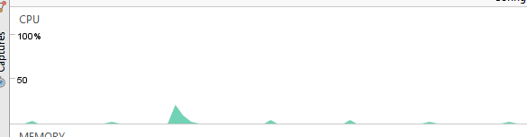
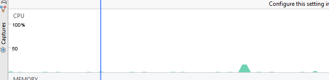

Uma boa prática em questão de performance é acessar os dados que se precisa utilizar percorrendo o menor caminho possível, sendo ele o menos custoso para se processar. Um exemplo disso, que analisei visualizando as formas de onda geradas pelo Android Profiler são os métodos get e set. Evitar o uso desses métodos acelera o processamento de seu aplicativo. Uma alternativa para isso é acessar os atributos diretamente, sendo assim o valor que se quer é obtido de forma mais rápida. Uma modificação que realizei foi ao acessar atributos de uma classe que cria notificação.  

Antes:  
mToast("Notificação " + notification.getTitle() + ": " + notification.getText());

Depois:  
mToast("Notificação " + notification.title + ": " + notification.text);  

Ao utilizar métodos gets e sets em loops a queda na performance é ainda mais notável.
Outra boa prática é saber utilizar bem o for() dependendo se sua aplicação. Muitas vezes ele é utilizado de modo custoso, e por se tratar de um loop o resultado ruim pode ser bem significativo. Com isso alterei uma parte do meu código onde um array de strings é acessado para formar  uma lista de palavras. A segunda forma se mostrou uma operação menos custosa.  

Antes:  
// Adicionando as linhas.  
int i;

for(i = 0; i < texts.length; i++){  
    style.addLine(texts[i]);  
}  

Depois:  

for(String line : texts){  
    style.addLine(line);  
}  

  Além disso, é aconselhável utilizar o mínimo possível ponto flutuante. Sempre que puder usar inteiro
  ou byte melhor, pois trabalhar com ponto flutuante além de ocupar mais espaço a operação é mais lenta.  
  Para gerar os gráficos abaixo realizei a execução do for() com um array com dezenas de strings para que  
  a diferença ficasse perseptível. Estão na mesma escala, sendo o segundo gráfico o otimizado.
  
  
  
  
